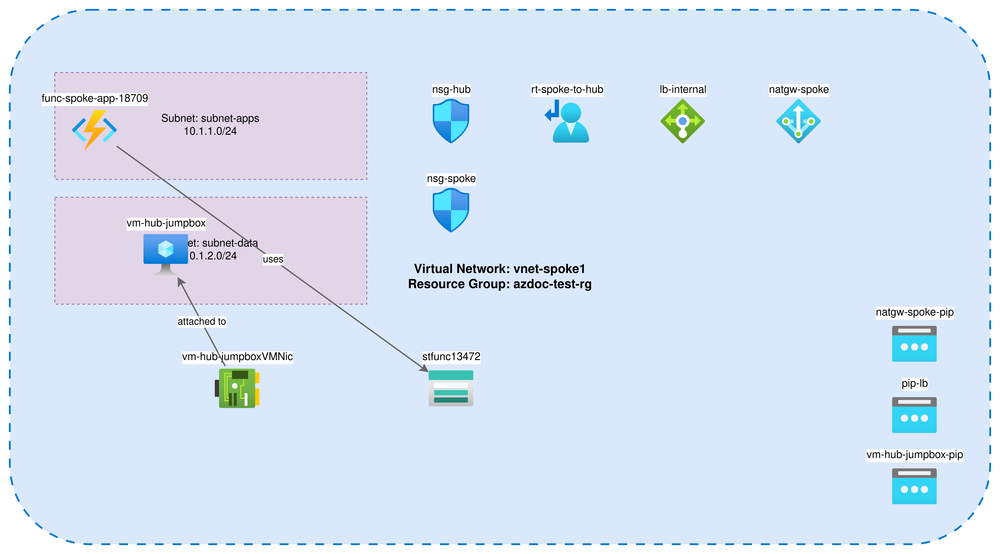

<div align="center">
  

  # azdoc - AI-Powered Azure Documentation & Analysis
A powerful CLI tool that generates comprehensive documentation for Azure subscriptions, including AI-enhanced network topology diagrams, security configurations, routing tables, and more.

  **Harness the power of GenAI to analyze your Azure infrastructure, document better**

  Transform raw Azure resources into comprehensive documentation with intelligent analysis, prioritized recommendations, and AI-generated remediation strategies.

  <br/>

  ### 📊 See It In Action

  

  *AI-discovered VNet architecture with intelligent resource connections*

  **[📄 View Full Example Report](examples/EXAMPLE_REPORT.md)** | **[🎨 Professional Azure Icons](https://learn.microsoft.com/en-us/azure/architecture/icons/)** | **[⚡ Quick Start](#quick-start)**

</div>

## Features

### 🏢 Platform Team Essentials
- **Executive Summary Dashboard**: At-a-glance infrastructure health with scores across security, cost, tagging, and compliance
- **Security & Compliance Analysis**: Automated security posture assessment with NSG analysis, encryption checks, and compliance scoring
- **Cost Optimization**: Detect orphaned resources, idle VMs, oversized SKUs with estimated monthly savings
- **Tagging Strategy**: Track tagging compliance, detect inconsistencies, and enforce governance policies
- **DR & Monitoring**: Assess backup coverage, monitoring gaps, and geo-redundancy status

### 🤖 AI-Powered Insights (Optional)
- **AI Security Insights**: Strategic security analysis with prioritized remediation roadmap aligned to Azure Well-Architected Framework
- **AI Cost Optimization**: Advanced cost optimization strategies beyond basic detection, with effort assessment
- **Smart Network Diagrams**: Intelligent connection discovery using GPT-4 analysis of resource properties
- **Architecture Descriptions**: AI-generated explanations of resource group purpose and architecture patterns

### 📊 Documentation & Visualization
- **Comprehensive Inventory**: Enumerate all Azure resources (VNets, Subnets, NSGs, Route Tables, Gateways, VMs, Function Apps, etc.)
- **Official Azure Icons**: Professional diagrams using Azure's official icon library
- **IP Address Tables**: VNet/subnet allocation with available IP calculations
- **Routing Analysis**: Document UDRs, effective routes, peering configurations, and route tables
- **Azure Advisor Integration**: Fetch recommendations with AI-generated remediation steps
- **Deterministic Output**: Same inputs always produce the same documentation
- **Offline Mode**: Build documentation from cached data without Azure API calls

## Architecture

```
┌─────────────┐
│   CLI       │
│  (Cobra)    │
└──────┬──────┘
       │
       ├─► Discovery Layer ──► Azure Resource Graph + ARM SDK
       │                       │
       │                       ▼
       │                   Cache (JSON)
       │                       │
       ├─► Topology Builder ◄──┘
       │         │
       │         ▼
       └─► Renderers
           ├─► Markdown (templates)
           ├─► Draw.io (XML)
           └─► LLM Explainer (optional)
```

## Installation

### From Source

```bash
git clone https://github.com/automationpi/azdocs.git
cd azdocs
go build -o azdoc ./cmd/azdoc
```

### Binary Installation

```bash
# Download the latest release
curl -LO https://github.com/automationpi/azdocs/releases/latest/download/azdoc-linux-amd64

# Make it executable
chmod +x azdoc-linux-amd64

# Move to PATH
sudo mv azdoc-linux-amd64 /usr/local/bin/azdoc
```

## 🤖 How AI Solves Your Azure Problems

**Stop manually hunting for security issues, cost waste, and compliance gaps.** Let GenAI do the heavy lifting.

### The Problem: Manual Azure Analysis is Time-Consuming

- ❌ Hours spent reviewing NSG rules for security holes
- ❌ Manually calculating potential cost savings
- ❌ Tracking down orphaned resources and idle VMs
- ❌ Understanding complex resource relationships
- ❌ Creating prioritized remediation roadmaps

### The Solution: AI-Powered Automated Analysis

```bash
# Let AI analyze your entire Azure infrastructure in minutes
export OPENAI_API_KEY="sk-..."
azdoc all --subscription-id <sub-id> --with-diagrams --enable-ai
```

### What AI Does For You:

**🔒 Security Analysis**
- ✅ Identifies critical security risks across your infrastructure
- ✅ Groups related security findings into strategic themes
- ✅ Generates prioritized remediation roadmap (Priority 1-10)
- ✅ Provides step-by-step fix instructions aligned with Azure Well-Architected Framework
- ✅ Estimates risk level and business impact for each issue

**💰 Cost Optimization**
- ✅ Discovers hidden cost optimization opportunities beyond basic detection
- ✅ Recommends reserved instances, right-sizing, and architectural improvements
- ✅ Calculates estimated monthly savings with effort assessment (Low/Medium/High)
- ✅ Prioritizes optimizations by ROI
- ✅ Suggests Azure pricing strategies (hybrid benefit, spot instances, etc.)

**🔗 Smart Infrastructure Understanding**
- ✅ Automatically discovers connections between resources (NIC→VM, Function→Storage, VNet peering)
- ✅ Analyzes resource properties and naming conventions to map relationships
- ✅ Generates intelligent network diagrams with accurate topology
- ✅ Explains architecture patterns and resource group purposes

**📋 Actionable Remediation**
- ✅ Fetches Azure Advisor recommendations
- ✅ Converts generic recommendations into step-by-step remediation plans
- ✅ Includes CLI commands, prerequisites, and validation steps
- ✅ Estimates time to implement each fix

### AI Cost: ~$0.20-0.40 per subscription analysis

**ROI:** Saves hours of manual analysis and identifies cost savings that pay for itself 100x over.

### Works Without AI Too

- ✅ Rule-based analysis for offline/cost-conscious scenarios
- ✅ Basic security, cost, and tagging analysis included
- ✅ No AI required for core functionality

See [AI_FEATURES.md](AI_FEATURES.md) and [IMPLEMENTATION_SUMMARY.md](IMPLEMENTATION_SUMMARY.md) for complete details.

## Quick Start

### 0. Try with Example Resources (Optional)

Want to test azdoc without using your production Azure environment? We provide scripts to create test resources!

```bash
# Deploy sample Azure resources (costs ~$1-2/day)
cd examples
./deploy-test-resources.sh

# This creates:
# - 2 VNets (Hub and Spoke)
# - 4 Subnets
# - 2 NSGs with rules
# - 1 Route Table
# - VNet Peering
# - Load Balancer, NAT Gateway

# See examples/README.md for full details
```

After testing, cleanup to avoid charges:
```bash
cd examples
./cleanup-test-resources.sh
```

### 1. Authenticate to Azure

```bash
# Using Azure CLI
az login

# OR set service principal credentials
export AZURE_CLIENT_ID="your-client-id"
export AZURE_CLIENT_SECRET="your-client-secret"
export AZURE_TENANT_ID="your-tenant-id"
```

### 2. Verify Setup

```bash
azdoc doctor --subscription-id <your-subscription-id>
```

### 3. Generate AI-Powered Documentation & Analysis

```bash
# 🤖 RECOMMENDED: Full AI-powered analysis
export OPENAI_API_KEY="sk-..."
azdoc all --subscription-id <your-subscription-id> --with-diagrams --enable-ai

# What happens:
# ✅ Scans all Azure resources
# 🤖 AI analyzes security posture → Generates prioritized findings
# 🤖 AI analyzes cost patterns → Identifies optimization opportunities
# 🤖 AI discovers resource connections → Creates accurate diagrams
# 🤖 AI generates remediation steps → Actionable fix instructions
# 📄 Generates comprehensive documentation with all insights

# ⚡ Quick mode (without AI - still powerful!)
azdoc all --subscription-id <your-subscription-id> --with-diagrams
# Uses rule-based analysis, perfect for offline or cost-conscious scenarios
```

**Advanced: Run steps individually**
```bash
# Step 1: Scan and cache Azure resources
azdoc scan --subscription-id <your-subscription-id>

# Step 2: Build documentation with AI analysis
export OPENAI_API_KEY="sk-..."
azdoc build --with-diagrams --enable-ai
```

### 4. View AI-Generated Results

```bash
# 📄 Main documentation with AI insights
cat docs/SUBSCRIPTION.md

# 🎨 Diagrams with intelligent connections
open docs/diagrams/*.drawio
```

**Example AI-Generated Output:**

```markdown
## Executive Summary Dashboard
| Category | Score | Status | Key Metrics |
|----------|-------|--------|-------------|
| 🔒 Security Posture | 67/100 | ⚠️ NEEDS ATTENTION | 2 Critical, 5 High, 8 Medium issues |
| 💰 Cost Optimization | 73/100 | ⚠️ NEEDS OPTIMIZATION | $1,247/mo, save $387/mo (31%) |
| 🏷️ Tagging Compliance | 45/100 | 🔴 POOR | 45% tagged (18/40 resources) |

### 🤖 AI-Powered Security Insights

#### 🔴 Priority 1: Network Segmentation Inadequate
**Category:** Network Security | **Severity:** Critical

**Description:** Multiple NSG rules allow unrestricted inbound access from
0.0.0.0/0 on management ports (SSH, RDP). This creates significant attack
surface and violates zero-trust principles...

**Risk Level:** Attackers can directly attempt authentication against all VMs

**Impact:** Potential unauthorized access, data breach, lateral movement

**Recommendations:**
- Implement Azure Bastion for all administrative access ($140/mo)
- Remove all 0.0.0.0/0 source addresses from NSG rules
- Enable Just-In-Time VM Access for production VMs
- Implement Azure Firewall for centralized ingress/egress control

---

#### 💰 Priority 1: Reserved Instance Opportunity
**Category:** Compute | **Effort:** 🟡 Medium | **Savings:** $180.00/month

**Description:** 4 Standard_D2s_v3 VMs running 24/7 with consistent workloads.
Current pay-as-you-go pricing at $0.096/hr could be reduced 40% with 1-year
reserved instances...

**Recommendations:**
- Purchase 1-year Reserved Instances for Standard_D2s_v3 (East US)
- Consider Azure Hybrid Benefit if you have Windows Server licenses
- Evaluate Azure Savings Plans for flexibility across VM families
```

**The AI transforms raw data into actionable intelligence!** 🎯

## CLI Commands

### `azdoc scan`

Scan Azure subscription and cache resource data.

```bash
azdoc scan \
  --subscription-id <sub-id> \
  --concurrency 8 \
  --timeout 5m \
  --cache-dir .azdoc \
  --json-out ./data
```

**Flags:**
- `--subscription-id`: Azure subscription ID (required)
- `--tenant-id`: Azure tenant ID (optional)
- `--concurrency`: Number of concurrent API requests (default: 8)
- `--timeout`: Overall operation timeout (default: 5m)
- `--cache-dir`: Cache directory (default: .azdoc)
- `--json-out`: Output directory for JSON files (default: ./data)
- `--no-progress`: Suppress progress indicators

### `azdoc build`

Build documentation from cached data with optional AI-enhanced diagrams.

```bash
# With AI-enhanced connection discovery
export OPENAI_API_KEY="sk-..."
azdoc build \
  --in ./data \
  --out ./docs \
  --with-diagrams \
  --enable-ai \
  --md-name SUBSCRIPTION.md \
  --theme default

# Without AI (offline mode, rule-based connections)
azdoc build \
  --in ./data \
  --out ./docs \
  --with-diagrams
```

**Flags:**
- `--in`: Input directory with cached JSON (default: ./data)
- `--out`: Output directory (default: ./docs)
- `--with-diagrams`: Generate Draw.io diagrams (default: true)
- `--enable-ai`: Enable AI-powered connection discovery (requires OpenAI API key)
- `--openai-key`: OpenAI API key (or set OPENAI_API_KEY env var)
- `--md-name`: Markdown filename (default: SUBSCRIPTION.md)
- `--theme`: Diagram theme (default, dark, light)

### `azdoc explain`

Add LLM-generated explanations to documentation (currently being refactored).

```bash
export OPENAI_API_KEY="your-key"
azdoc explain \
  --in ./data \
  --doc ./docs/SUBSCRIPTION.md \
  --model gpt-4o-mini \
  --max-tokens 2000
```

**Note:** This command is currently being refactored for AI integration. Use `build --enable-ai` for AI-enhanced diagrams.

**Flags:**
- `--in`: Input directory with cached JSON (default: ./data)
- `--doc`: Documentation file to enhance (default: ./docs/SUBSCRIPTION.md)
- `--model`: OpenAI model (default: gpt-4o-mini)
- `--max-tokens`: Maximum tokens (default: 2000)
- `--dry-run`: Preview without modifying files

### `azdoc all`

Run scan → build in sequence with optional AI-enhanced diagrams.

```bash
# With AI-enhanced diagrams
export OPENAI_API_KEY="sk-..."
azdoc all \
  --subscription-id <sub-id> \
  --with-diagrams \
  --enable-ai

# Without AI (offline mode)
azdoc all \
  --subscription-id <sub-id> \
  --with-diagrams
```

**Flags:**
- All flags from `scan` and `build` commands
- `--enable-ai`: Enable AI-powered diagram generation
- `--openai-key`: OpenAI API key (or set OPENAI_API_KEY env var)

### `azdoc doctor`

Verify Azure authentication and permissions.

```bash
azdoc doctor --subscription-id <sub-id>
```

### `azdoc version`

Print version information.

```bash
azdoc version
```

## Configuration File

Create `azdoc.yaml` in your project directory:

```yaml
subscription-id: "your-subscription-id"

output:
  data-dir: "./data"
  docs-dir: "./docs"

discovery:
  concurrency: 8
  timeout: "5m"

rendering:
  with-diagrams: true
  theme: "default"

ai:
  enabled: false
  openai-key: ""  # Or set OPENAI_API_KEY env var
  model: "gpt-4-turbo-preview"
```

See [azdoc.yaml.example](azdoc.yaml.example) for complete configuration options.

## Output Structure

```
├── data/
│   ├── raw/              # Raw Azure API responses
│   ├── normalized/       # Normalized resource models
│   ├── graph.json        # Topology graph
│   └── metadata.json     # Scan metadata
├── docs/
│   ├── SUBSCRIPTION.md   # Main documentation
│   └── diagrams/
│       ├── VNet-Hub.drawio
│       ├── VNet-Spoke1.drawio
│       └── InterVNet.drawio
└── .azdoc/               # Cache directory
```

## Documentation Features

### Generated Markdown Includes:

- **Executive Summary**: High-level overview and statistics
- **Resource Inventory**: Tables of all discovered resources
- **Network Topology**: VNet architecture and connectivity
- **Security**: NSG rules, ASGs, Firewall policies
- **Routing**: UDRs, effective routes, peerings, gateways
- **Private Endpoints**: Private Link configurations
- **Load Balancers**: LB and Application Gateway configurations
- **Provenance**: ARM queries used and timestamps

### Draw.io Diagrams:

- One diagram per VNet showing subnets, appliances, and connections
- **AI-Discovered Connections**: Intelligent analysis of resource relationships (NIC→VM, Function→Storage)
- **Official Azure Icons**: Professional icons for all resource types (VMs, Function Apps, Storage, NSGs, etc.)
- Inter-VNet diagram showing peering and gateway transit
- Subnet containers for logical grouping
- High-confidence connections only (filters out noise)
- Fallback to rule-based connections when AI is disabled

## AI Features

### Connection Discovery (Active)

When `--enable-ai` is used with `build` command:

- **Intelligent Connection Analysis**: AI analyzes Azure resource properties to discover relationships
- **Supported Connections**:
  - NIC attachments to VMs (via `properties.virtualMachine.id`)
  - Function App dependencies on Storage Accounts
  - VNet peering relationships
  - NSG subnet associations
  - Public IP attachments
  - NAT Gateway associations
- **Confidence Scoring**: Only high-confidence connections are rendered
- **Cost**: ~$0.03-0.06 per diagram, ~$0.15 per full build
- **Console Feedback**: See exactly which AI connections were applied

**How it works:**
1. LLM receives full Azure resource JSON with all properties
2. Analyzes naming conventions, property references, and resource relationships
3. Returns structured JSON with connection suggestions and confidence levels
4. azdoc renders only high-confidence connections automatically

### Layout Optimization (Coming Soon)

- AI-suggested resource positioning
- Optimal grouping based on relationships
- Subnet-aware placement

**Safety Features:**
- **Graceful Fallback**: Rule-based connections when AI is disabled or unavailable
- **No Hallucination**: AI only analyzes existing Azure data
- **Privacy**: Only resource metadata sent to OpenAI (no secrets/keys)
- **HTTPS**: All API calls encrypted

See [AI_FEATURES.md](AI_FEATURES.md) for detailed documentation.

## Permissions Required

Minimum Azure RBAC permissions:

- **Reader** role on the subscription
- **Resource Graph Reader** for inventory queries

Optional (for effective routes):
- **Network Contributor** or custom role with `Microsoft.Network/networkInterfaces/effectiveRouteTable/action`

## Performance

- **Small subscriptions** (<100 resources): ~30 seconds
- **Medium subscriptions** (100-1000 resources): ~2 minutes
- **Large subscriptions** (1000-10000 resources): ~10 minutes

Caching and concurrency settings can be tuned for your environment.

## Development

### Project Structure

```
azdoc/
├── cmd/azdoc/                # CLI entry point
│   └── commands/             # Cobra commands
├── pkg/
│   ├── auth/                 # Azure authentication
│   ├── cache/                # Local caching
│   ├── config/               # Configuration management
│   ├── discovery/            # Resource discovery
│   ├── graph/                # Topology graph builder
│   ├── llm/                  # LLM integration
│   ├── models/               # Data models
│   └── renderer/             # Output renderers
└── internal/
    └── utils/                # Utilities
```

### Build from Source

```bash
# Install dependencies
go mod download

# Build
go build -o azdoc ./cmd/azdoc

# Run tests
go test ./...

# Build with version info
go build -ldflags "-X main.Version=1.0.0 -X main.GitCommit=$(git rev-parse HEAD) -X main.BuildDate=$(date -u +%Y-%m-%dT%H:%M:%SZ)" -o azdoc ./cmd/azdoc
```

### Testing

```bash
# Unit tests
go test ./pkg/...

# Integration tests (requires Azure credentials)
go test ./tests/integration/...

# Golden file tests
go test ./tests/golden/...
```

## Roadmap

### Sprint 1 (MVP - P0)
- [x] CLI skeleton with Cobra
- [x] Azure authentication (CLI + Service Principal)
- [x] Data models for network resources
- [ ] Resource Graph inventory discovery
- [ ] ARM SDK detail fetchers
- [ ] Topology graph builder
- [ ] Markdown renderer with templates
- [ ] Draw.io diagram generation
- [ ] Routing summary with UDRs
- [ ] Caching with etags

### Sprint 2 (P1)
- [ ] LLM explainer with 2-parse validation
- [ ] Markdown QA (linter, link checker)
- [ ] Configuration filters (include/exclude)
- [ ] Rate limiting and backoff
- [ ] PII redaction

### Sprint 3 (P2)
- [ ] Change reports (diff previous runs)
- [ ] Inter-VNet super-diagram
- [ ] Multi-format export (HTML, PDF)
- [ ] CI/CD templates

## Contributing

Contributions welcome! Please see [CONTRIBUTING.md](CONTRIBUTING.md) for guidelines.

## License

MIT License - see [LICENSE](LICENSE) for details.

## Support

- **Issues**: https://github.com/automationpi/azdocs/issues
- **Discussions**: https://github.com/automationpi/azdocs/discussions
- **AI Features Documentation**: See [AI_FEATURES.md](AI_FEATURES.md)

## Acknowledgments

Built with:
- [Cobra](https://github.com/spf13/cobra) - CLI framework
- [Viper](https://github.com/spf13/viper) - Configuration management
- [Azure SDK for Go](https://github.com/Azure/azure-sdk-for-go) - Azure API clients
- [OpenAI Go SDK](https://github.com/sashabaranov/go-openai) - AI integration
- [Azure Official Icons](https://learn.microsoft.com/en-us/azure/architecture/icons/) - Diagram assets
