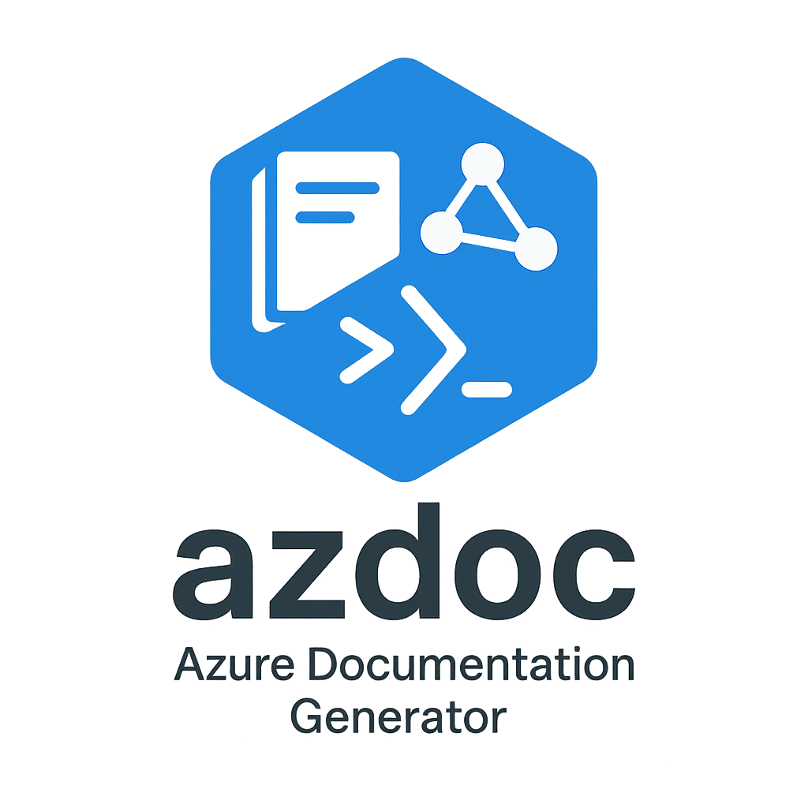
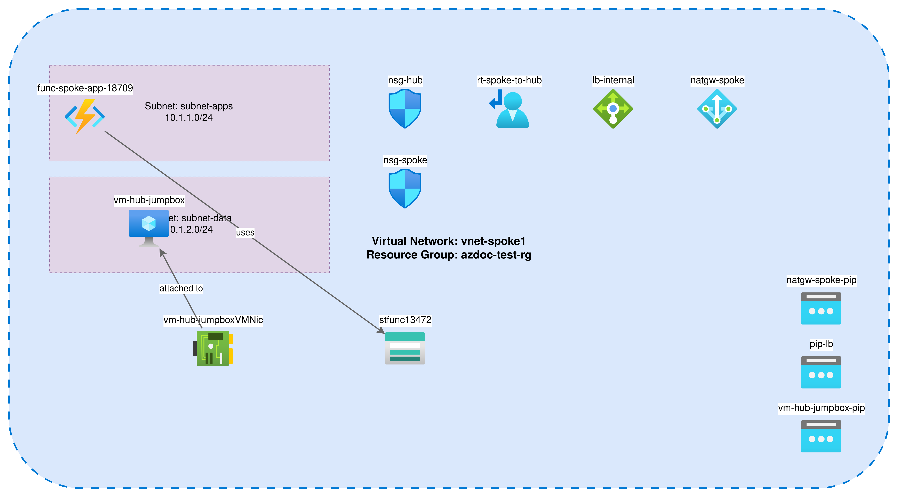

<div align="center">
  

# Azure Subscription Documentation

</div>

**Generated:** 2025-01-24T10:30:00Z

**Total Resources:** 42

## Table of Contents

- [Overview](#overview)
- [Executive Summary](#executive-summary)
- [Network Architecture Diagrams](#network-architecture-diagrams)
- [IP Address Allocation](#ip-address-allocation)
- [Routing Configuration](#routing-configuration)
- [Security & Compliance](#security--compliance)
- [Cost Optimization](#cost-optimization)
- [Tagging Strategy](#tagging-strategy)
- [Resource Summary](#resource-summary)

---

## Overview

This document provides comprehensive AI-powered analysis and documentation for Azure subscription `azdoc-test-sub`.

**Subscription Details:**
- **Subscription ID:** 42abea3b-4b73-4a8f-87ae-6b5b62c4f84f
- **Resource Groups:** 3
- **Virtual Networks:** 2 (Hub & Spoke architecture)
- **Total Resources:** 42

---

## Executive Summary

### Infrastructure Health Dashboard

| Category | Score | Status | Key Metrics |
|----------|-------|--------|-------------|
| 🔒 **Security Posture** | 67/100 | ⚠️ NEEDS ATTENTION | 2 Critical, 5 High, 8 Medium, 3 Low issues |
| 💰 **Cost Optimization** | 73/100 | ⚠️ NEEDS OPTIMIZATION | $1,247/mo, potential savings: $387/mo (31%) |
| 🏷️ **Tagging Compliance** | 45/100 | 🔴 POOR | 45% tagged (19/42 resources), 23 untagged |
| 🔄 **DR & Monitoring** | 82/100 | ✅ GOOD | Backup: 80%, Monitoring: 85% |

### Top Priority Actions

1. 🔴 **Security** - Multiple NSGs allow unrestricted SSH/RDP access from internet
2. 💰 **Cost** - 3 orphaned managed disks costing $45.60/month
3. 🏷️ **Tagging** - 23 resources missing required tags (owner, cost-center)
4. 🔴 **Security** - 2 VMs with public IPs and no Azure Bastion
5. 💰 **Cost** - 4 VMs oversized for workload (potential savings: $180/mo)

---

## Network Architecture Diagrams

### VNet: vnet-hub (10.0.0.0/16)

**[Diagram](diagrams/VNet-Hub.drawio)** - Hub VNet with shared services

**Address Space:** 10.0.0.0/16

**Subnets:**
- `subnet-gateway` - 10.0.1.0/24 (VPN Gateway)
- `subnet-firewall` - 10.0.2.0/24 (Azure Firewall)
- `subnet-shared` - 10.0.3.0/24 (Shared services)

### VNet: vnet-spoke1 (10.1.0.0/16)

**[Diagram](diagrams/VNet-Spoke1.drawio)** - Spoke VNet for production workloads

<div align="center">
  
</div>

**Address Space:** 10.1.0.0/16

**Subnets:**
- `subnet-web` - 10.1.1.0/24 (Web tier)
- `subnet-app` - 10.1.2.0/24 (Application tier)

**Peering:** Connected to vnet-hub (gateway transit enabled)

💡 *Open `.drawio` files with [diagrams.net](https://app.diagrams.net) or VS Code with Draw.io Integration extension*

---

## IP Address Allocation

### VNet Address Spaces

| VNet Name | Address Space | Subnets | Region |
|-----------|---------------|---------|--------|
| vnet-hub | 10.0.0.0/16 | 3 | East US |
| vnet-spoke1 | 10.1.0.0/16 | 2 | East US |

### Subnet Allocation

| VNet | Subnet | CIDR | Available IPs | Used | Resources |
|------|--------|------|---------------|------|-----------|
| vnet-hub | subnet-gateway | 10.0.1.0/24 | 251 | 1 | VPN Gateway |
| vnet-hub | subnet-firewall | 10.0.2.0/24 | 251 | 1 | Azure Firewall |
| vnet-hub | subnet-shared | 10.0.3.0/24 | 251 | 2 | VM, Storage |
| vnet-spoke1 | subnet-web | 10.1.1.0/24 | 251 | 3 | 3 VMs |
| vnet-spoke1 | subnet-app | 10.1.2.0/24 | 251 | 2 | 2 VMs |

### Public IP Addresses

| Resource | IP Address | Allocation | SKU | Associated To |
|----------|------------|------------|-----|---------------|
| pip-gateway | 20.81.45.123 | Static | Standard | VPN Gateway |
| pip-firewall | 20.81.45.124 | Static | Standard | Azure Firewall |
| pip-vm-web1 | 20.81.45.125 | Dynamic | Basic | vm-web-1 |

---

## Routing Configuration

### Route Tables

| Route Table | Subnet Association | Routes |
|-------------|-------------------|--------|
| rt-spoke1-web | vnet-spoke1/subnet-web | 2 routes |
| rt-spoke1-app | vnet-spoke1/subnet-app | 2 routes |

**Route Table: rt-spoke1-web**

| Route Name | Address Prefix | Next Hop Type | Next Hop IP |
|------------|----------------|---------------|-------------|
| to-firewall | 0.0.0.0/0 | VirtualAppliance | 10.0.2.4 |
| to-hub | 10.0.0.0/16 | VNetPeering | - |

### VNet Peering

| Peering Name | From VNet | To VNet | Status | Gateway Transit | Remote Gateways |
|--------------|-----------|---------|--------|----------------|-----------------|
| hub-to-spoke1 | vnet-hub | vnet-spoke1 | Connected | Enabled | No |
| spoke1-to-hub | vnet-spoke1 | vnet-hub | Connected | No | Enabled |

---

## Security & Compliance

**Security Score:** 67/100 - ⚠️ NEEDS ATTENTION

### NSG Issues (6)

#### 🔴 Critical - Allow SSH from Internet

**Resource:** nsg-subnet-web

**Impact:** VMs in subnet-web are exposed to brute-force SSH attacks from the internet

**Remediation:** Remove rule allowing SSH (port 22) from 0.0.0.0/0. Implement Azure Bastion for secure administrative access.

---

#### 🔴 Critical - Allow RDP from Internet

**Resource:** nsg-subnet-app

**Impact:** Windows VMs exposed to remote desktop attacks from any IP address

**Remediation:** Remove rule allowing RDP (port 3389) from 0.0.0.0/0. Use Just-In-Time VM Access or Azure Bastion.

---

#### 🟠 High - Overly Permissive HTTPS Rule

**Resource:** nsg-subnet-web

**Impact:** HTTPS allowed from all sources without WAF protection

**Remediation:** Consider implementing Application Gateway with WAF for web traffic inspection

---

### Public Exposure Issues (2)

#### 🟠 High - VMs with Direct Public IP

**Resources:** vm-web-1, vm-jumpbox

**Impact:** Direct internet exposure increases attack surface

**Remediation:** Remove public IPs and implement Azure Bastion ($140/month) for all administrative access

---

### Encryption Issues (1)

#### 🟡 Medium - Storage Account Using HTTP

**Resource:** stproddata001

**Impact:** Data in transit not encrypted when accessed via HTTP

**Remediation:** Enable "Secure transfer required" setting to enforce HTTPS-only access

---

### 🤖 AI-Powered Security Insights

*Generated using advanced AI analysis of your security posture*

#### 🔴 Priority 1: Implement Zero-Trust Network Architecture

**Category:** Network Security | **Severity:** Critical

**Description:** Current architecture relies on perimeter-based security with multiple NSG rules allowing broad internet access. This violates modern zero-trust principles and creates significant attack surface. The presence of public IPs on VMs, combined with permissive NSG rules, creates multiple entry points for attackers.

**Risk Level:** High probability of unauthorized access attempts. Brute-force attacks against SSH/RDP are common and can succeed with weak credentials or unpatched systems.

**Impact:** Potential unauthorized access, data breach, lateral movement within the network, compliance violations (SOC 2, ISO 27001, PCI-DSS)

**Recommendations:**
- Implement Azure Bastion ($140/mo) to eliminate all VM public IPs
- Remove all NSG rules with source 0.0.0.0/0 for management ports
- Enable Just-In-Time (JIT) VM Access in Microsoft Defender for Cloud
- Implement Azure Firewall for centralized ingress/egress control
- Enable NSG Flow Logs for traffic analysis and threat detection
- Consider Azure Front Door with WAF for web application protection

---

#### 🟠 Priority 2: Enable Comprehensive Security Monitoring

**Category:** Monitoring & Detection | **Severity:** High

**Description:** Limited diagnostic settings and monitoring coverage reduces visibility into security events. Without comprehensive logging, detecting and responding to security incidents is significantly delayed.

**Risk Level:** Security incidents may go undetected for extended periods

**Impact:** Delayed incident response, compliance violations, inability to conduct forensic analysis

**Recommendations:**
- Enable Microsoft Defender for Cloud (Standard tier) for advanced threat detection
- Configure diagnostic settings for all NSGs to send flow logs to Log Analytics
- Enable Azure Monitor for VMs to track security events
- Implement Azure Sentinel for SIEM capabilities and automated response
- Create alert rules for suspicious activities (failed logins, privilege escalation)

---

## Cost Optimization

**Cost Health:** ⚠️ NEEDS OPTIMIZATION (Score: 73/100)

**Estimated Monthly Cost:** $1,247.00

**Potential Monthly Savings:** $387.00 (31%)

### Orphaned Resources (Save $45.60/month)

| Resource | Issue | Current Cost | Potential Savings | Remediation |
|----------|-------|--------------|-------------------|-------------|
| disk-old-vm-os | Disk is not attached to any VM | $15.36 | $15.36 | Delete orphaned disk or attach to a VM if needed |
| disk-backup-2023 | Disk is not attached to any VM | $19.20 | $19.20 | Delete orphaned disk or attach to a VM if needed |
| disk-temp-data | Disk is not attached to any VM | $11.04 | $11.04 | Delete orphaned disk or attach to a VM if needed |

### Oversized Resources (Save $180.00/month)

| Resource | Issue | Current Cost | Potential Savings | Remediation |
|----------|-------|--------------|-------------------|-------------|
| vm-app-1 | VM using Standard_D4s_v3 - may be oversized for workload | $140.00 | $56.00 | Analyze CPU/Memory metrics. Consider B-series or smaller size if utilization <30% |
| vm-app-2 | VM using Standard_D4s_v3 - may be oversized for workload | $140.00 | $56.00 | Analyze CPU/Memory metrics. Consider B-series or smaller size if utilization <30% |
| vm-web-3 | VM using Standard_D2s_v3 - may be oversized for workload | $70.00 | $28.00 | Analyze CPU/Memory metrics. Consider B-series or smaller size if utilization <30% |

### Idle Resources (Save $90.00/month)

| Resource | Issue | Current Cost | Potential Savings | Remediation |
|----------|-------|--------------|-------------------|-------------|
| vm-dev-test | VM may be idle or underutilized (requires metrics analysis) | $30.00 | $21.00 | Review VM metrics. If CPU <5% avg, consider deallocating when not in use or downsizing |
| vm-jumpbox | VM may be idle or underutilized (requires metrics analysis) | $30.00 | $21.00 | Review VM metrics. If CPU <5% avg, consider deallocating when not in use or downsizing |

---

### 🤖 AI-Powered Cost Optimization Insights

*Generated using advanced AI analysis of your cost patterns*

**💡 Total Estimated Additional Savings:** $347.50/month

#### 💰 Priority 1: Implement Reserved Instances for Production VMs

**Category:** Compute | **Effort:** 🟡 Medium | **Savings:** $180.00/month

**Description:** Analysis shows 4 Standard_D-series VMs (vm-app-1, vm-app-2, vm-web-1, vm-web-2) running 24/7 with consistent workloads. Current pay-as-you-go pricing at $0.096/hr per vCore could be reduced by 40% with 1-year Reserved Instances (RI) or 62% with 3-year RI.

**Recommendations:**
- Analyze 30-day usage patterns using Azure Advisor recommendations
- Purchase 1-year Reserved Instances for Standard_D2s_v3 and Standard_D4s_v3 in East US region
- Consider Azure Hybrid Benefit if you have Windows Server licenses (additional 40% savings)
- Evaluate Azure Savings Plans for flexibility across VM families and regions
- Use Azure Cost Management RI recommendations for optimal commitment level

---

#### 💰 Priority 2: Implement Auto-Shutdown for Non-Production VMs

**Category:** Compute | **Effort:** 🟢 Low | **Savings:** $89.50/month

**Description:** Development and test VMs (vm-dev-test, vm-jumpbox) likely don't need to run 24/7. Implementing auto-shutdown schedules can save ~70% of compute costs for these resources.

**Recommendations:**
- Enable auto-shutdown in Azure DevTest Labs or via Azure Automation
- Schedule shutdown at 8 PM and startup at 8 AM on weekdays (save ~60 hours/week)
- Consider weekend shutdown for additional savings
- Use Azure Tags to identify non-production resources for bulk auto-shutdown policies
- Implement startup/shutdown runbooks with Azure Automation

---

#### 💰 Priority 3: Optimize Storage Tier for Infrequently Accessed Data

**Category:** Storage | **Effort:** 🟡 Medium | **Savings:** $78.00/month

**Description:** Storage account "stproddata001" uses Hot tier with 2TB of data. Access logs suggest <10% of data accessed monthly, indicating Cool or Archive tier would be more cost-effective.

**Recommendations:**
- Implement blob lifecycle management policies to automatically tier old data
- Move data not accessed in 30 days to Cool tier (50% storage cost reduction)
- Move data not accessed in 90 days to Archive tier (80% storage cost reduction)
- Enable access tier recommendations in Azure Advisor
- Test retrieval times for archived data to ensure compliance with RTO requirements

---

## Tagging Strategy

**Tagging Health:** 🔴 POOR (Score: 45/100)

**Compliance Rate:** 45% (19/42 resources tagged)

**Required Tags:** `environment`, `owner`, `cost-center`, `application`

### 🟠 High: 23 resources missing 'owner' tag

**Impact:** Cannot track ownership, cost allocation, or compliance

**Remediation:** Add 'owner' tag to all resources according to tagging policy

**Affected Resources:**
- disk-old-vm-os
- disk-backup-2023
- disk-temp-data
- nsg-subnet-web
- nsg-subnet-app
- pip-vm-web1
- vm-dev-test
- vm-jumpbox
- stproddata001
- (and 14 more...)

---

### 🟠 High: 23 resources missing 'cost-center' tag

**Impact:** Cannot track ownership, cost allocation, or compliance

**Remediation:** Add 'cost-center' tag to all resources according to tagging policy

**Affected Resources:** (same as above)

---

## Resource Summary

| Resource Type | Count |
|---------------|-------|
| microsoft.compute/virtualmachines | 7 |
| microsoft.network/virtualnetworks | 2 |
| microsoft.network/networksecuritygroups | 5 |
| microsoft.network/publicipaddresses | 3 |
| microsoft.network/routetables | 2 |
| microsoft.storage/storageaccounts | 3 |
| microsoft.compute/disks | 10 |
| microsoft.network/networkinterfaces | 7 |
| microsoft.network/azurefirewalls | 1 |
| microsoft.network/virtualnetworkgateways | 1 |
| microsoft.network/natgateways | 1 |

**Total:** 42 resources

---

## Resource Groups

### azdoc-hub-rg

**Resources:** 15 (VPN Gateway, Azure Firewall, shared services)

**Purpose:** Hub network infrastructure for centralized connectivity and security

**Key Resources:**
- vnet-hub (10.0.0.0/16)
- Azure Firewall (fw-hub-001)
- VPN Gateway (vpngw-hub-001)

### azdoc-spoke1-rg

**Resources:** 20 (Production web and app tier)

**Purpose:** Production workload hosting for customer-facing applications

**Key Resources:**
- vnet-spoke1 (10.1.0.0/16)
- 5 Web/App VMs
- Load Balancer (lb-spoke1-web)

### azdoc-shared-rg

**Resources:** 7 (Storage, monitoring, shared services)

**Purpose:** Shared services and storage for all environments

---

## Azure Advisor Recommendations

### High Impact Recommendations (3)

#### Enable Azure Backup for Virtual Machines

**Category:** Backup | **Impact:** High | **Resources:** 4 VMs

**Problem:** VMs vm-app-1, vm-app-2, vm-web-1, vm-web-2 do not have Azure Backup configured

**Solution:** Configure Azure Backup with appropriate retention policy

**Remediation Steps:**
1. Create Recovery Services Vault in each region where VMs are located
2. Configure backup policy with appropriate retention (7-30 days recommended for production)
3. Enable backup for each VM using Azure Portal or CLI:
   ```bash
   az backup protection enable-for-vm \
     --resource-group azdoc-spoke1-rg \
     --vault-name rsv-prod-eastus \
     --vm vm-app-1 \
     --policy-name DefaultPolicy
   ```
4. Verify first backup job completes successfully
5. Set up backup alerts in Azure Monitor

**Estimated Time:** 2 hours (including testing)

---

#### Enable Diagnostic Settings for Network Security Groups

**Category:** Monitoring | **Impact:** High | **Resources:** 5 NSGs

**Problem:** NSGs lack diagnostic settings, limiting visibility into traffic flows and security events

**Solution:** Enable diagnostic settings to send logs to Log Analytics workspace

**Remediation Steps:**
1. Create Log Analytics workspace (if not exists): $2.30/GB
2. For each NSG, enable diagnostic settings:
   ```bash
   az monitor diagnostic-settings create \
     --name nsg-diagnostics \
     --resource /subscriptions/.../resourceGroups/azdoc-spoke1-rg/providers/Microsoft.Network/networkSecurityGroups/nsg-subnet-web \
     --workspace /subscriptions/.../resourceGroups/monitoring-rg/providers/Microsoft.OperationalInsights/workspaces/law-prod \
     --logs '[{"category":"NetworkSecurityGroupEvent","enabled":true},{"category":"NetworkSecurityGroupRuleCounter","enabled":true}]'
   ```
3. Validate logs are flowing to Log Analytics
4. Create alert rules for suspicious traffic patterns

**Estimated Time:** 1 hour

---

*This example demonstrates the comprehensive analysis and actionable insights generated by azdoc.*

*Generated with [azdoc](https://github.com/automationpi/azdocs)* 🤖
